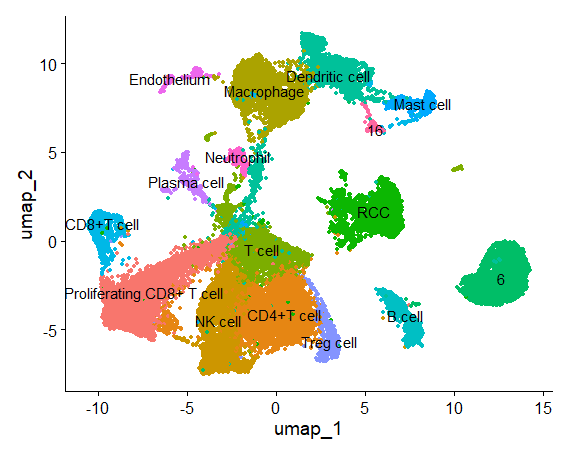
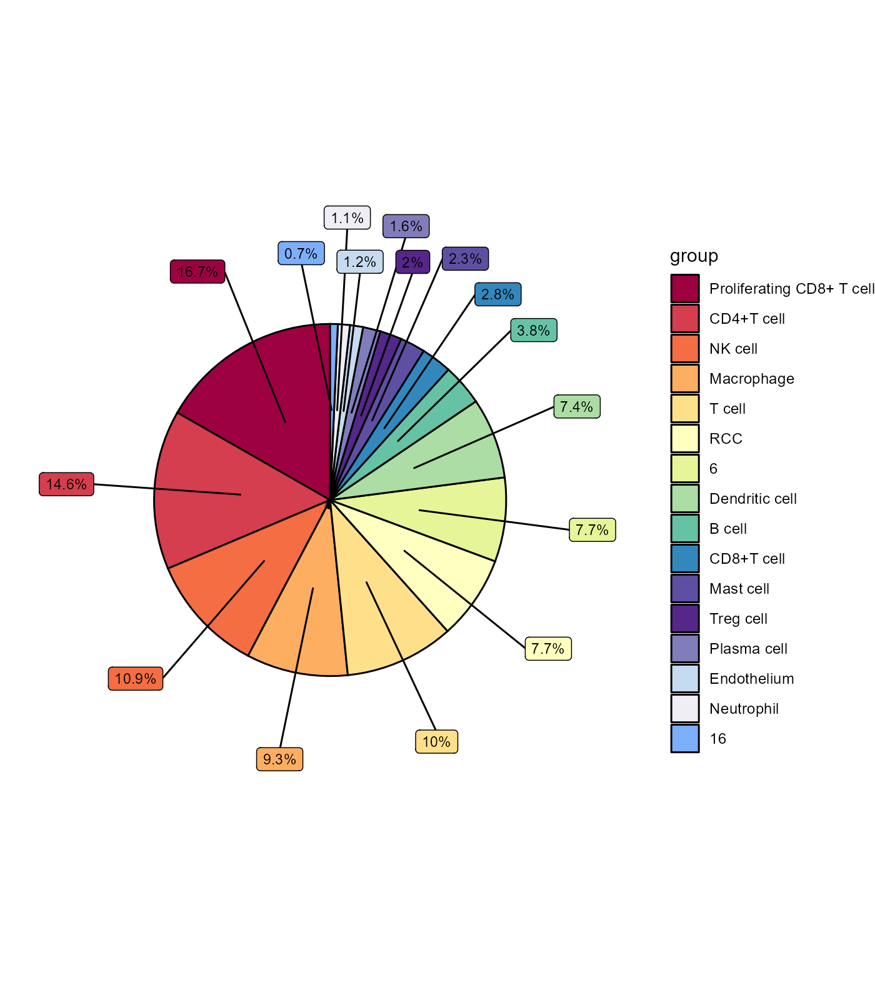
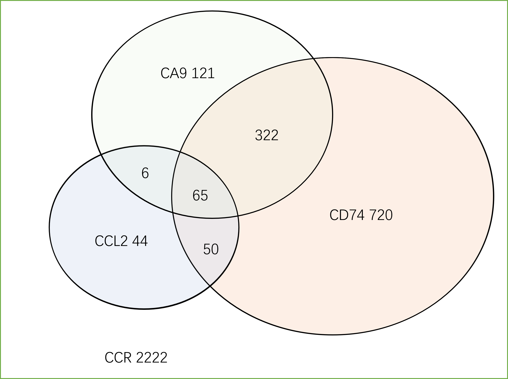
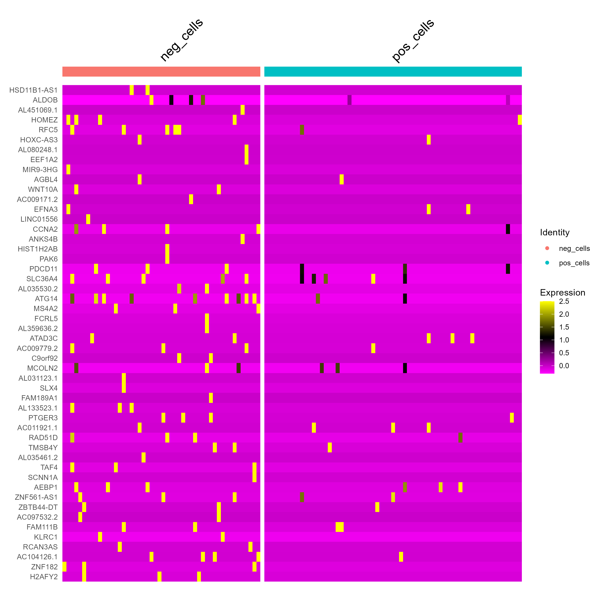
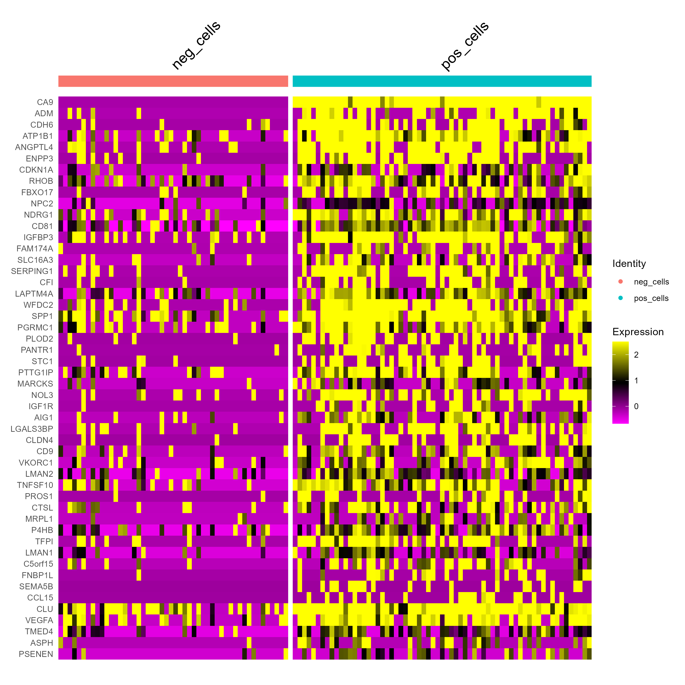

# RCC_scRNA-analysis
The data is sourced from:[https://www.ncbi.nlm.nih.gov/geo/query/acc.cgi?acc=GSE222703](https://www.ncbi.nlm.nih.gov/geo/query/acc.cgi?acc=GSE222703)

## Cell clustering
Identify markers for cell grouping based on literature and cluster single cells accordingly.

## Identify Differential expressed genes 
Locate cells expressing both CCL2+CD74+CA9+ and CCL2+CD74+CA9-.   
Identify the genes expressed in CCL2+CD74+CA9+ cells and not expressed in CCL2+CD74+CA9- cells.   
Arrange these genes in descending order based on their level of expression.  

